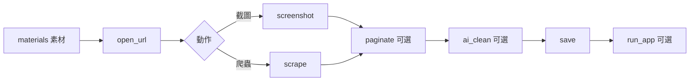

# 通用自動化任務 JSON 規格（v1.0）

像 API 文件一樣：先看**可能流程**，再看**固定 JSON 欄位**。  
之後不管爬蟲、截圖、AI 整理、開程式，都用同一份格式描述。

| 檔案 | 用途 |
|------|------|
| `task.schema.json` | 機器可驗證的 JSON Schema |
| `examples/*.json` | 可直接改的範例 |
| 本文件 | 給人看的說明 |

---

## 1. 總覽：一份任務長什麼樣

```json
{
  "version": "1.0",
  "meta": { "title": "可選說明" },
  "task": {
    "output": { "name": "存檔名稱", "dir": "output" },
    "materials": { "urls": [], "files": [], "text": "", "vars": {} },
    "defaults": { "headless": true },
    "actions": [ { "type": "...", "params": {} } ]
  }
}
```

對應你平常會準備的東西：

| 你說的 | JSON 欄位 |
|--------|-----------|
| 存檔名稱 | `task.output.name` |
| 資料素材 | `task.materials` |
| 連結、各類檔路徑 | `materials.urls` / `materials.files` |
| 執行動作 | `task.actions[]`（依序執行） |

---

## 2. 可能流程（Pipeline）

以下每條都是「先準備 materials → 再跑 actions」。

### 流程 A：單頁爬蟲
`open_url` → `scrape` →（可選）`ai_clean` → `save`

### 流程 B：單頁／整頁／滾動截圖
`open_url` → `screenshot(mode=single|full_page|scroll|element)`

### 流程 C：多頁截圖（點按鈕翻頁）
`open_url` → `screenshot(mode=multi_page, paginate.method=click)`

### 流程 D：多頁截圖（鍵盤翻頁）
`open_url` → `screenshot(mode=multi_page, paginate.method=key)`  
例如 `ArrowRight`、`PageDown`

### 流程 E：多頁爬蟲
`open_url` → `scrape`（內含 `paginate`）→ `save`

### 流程 F：爬蟲 + 截圖
`open_url` → `scrape` → `screenshot`

### 流程 G：素材已整理好，只做 AI／存檔／開程式
（可不開網頁）  
`ai_clean(source=materials.text)` → `save` → `run_app`

### 流程 H：抓完後丟給指定程式
`…` → `save` → `run_app(path=某.exe, args=[檔案路徑])`



---

## 3. 固定欄位說明

### 3.1 `version`
固定字串：`"1.0"`

### 3.2 `task.output`（存檔）

| 欄位 | 必填 | 說明 |
|------|------|------|
| `name` | 是 | 主檔名，例如 `專案A_結果` |
| `dir` | 否 | 輸出資料夾，預設 `output` |
| `overwrite` | 否 | 是否覆蓋，預設 `true` |

各 action 可用 `params.filename` 覆寫單步檔名。  
副檔名由動作決定：截圖 `.png`／`.jpeg`，文字 `.txt`，結構化 `.json` 等。

### 3.3 `task.materials`（資料素材）

| 欄位 | 說明 | 範例 |
|------|------|------|
| `urls` | 網址陣列 | `["https://a.com", "https://b.com"]` |
| `files` | 本機路徑 | `[{ "path": "D:/a.docx", "role": "source" }]` |
| `text` | 已整理純文字 | 你事先貼好的內容 |
| `json` | 已整理結構化資料 | 任意物件 |
| `vars` | 變數，供 `{{project}}` 替換 | `{ "project": "專案A" }` |

`files[].role` 建議值：`source` / `image` / `template` / `cookie`

### 3.4 `task.defaults`（全域預設）

| 欄位 | 說明 |
|------|------|
| `browser` | `chromium` / `chrome` / `edge` / `firefox` |
| `headless` | 是否背景瀏覽器 |
| `timeout_ms` | 導覽逾時 |
| `wait_ms` | 開頁後額外等待 |
| `viewport` | `{ "width", "height" }` |

### 3.5 `task.actions[]`（執行動作）

每個步驟：

```json
{
  "id": "可選識別",
  "type": "動作類型",
  "enabled": true,
  "params": { }
}
```

支援的 `type`：

| type | 用途 |
|------|------|
| `open_url` | 開啟網址 |
| `screenshot` | 截圖 |
| `scrape` | 爬蟲 |
| `paginate` | 獨立翻頁（較少用；通常內嵌在截圖／爬蟲） |
| `ai_clean` | AI 輔助整理 |
| `run_app` | 開啟指定程式 |
| `wait` | 等待時間或元素 |
| `save` | 把上一結果寫成檔 |

---

## 4. 各動作 params（重點）

### 4.1 `screenshot`

| 欄位 | 說明 |
|------|------|
| `mode` | `single` 可視區／`full_page` 整頁／`scroll` 滾動拼接／`element` 區塊／`multi_page` 多頁 |
| `selector` | `element` 模式必填；也可當截圖範圍 |
| `filename` | 檔名 |
| `scroll` | 滾動參數：`step_px` / `delay_ms` / `max_steps` |
| `paginate` | 多頁時的翻頁設定（見下） |

### 4.2 翻頁 `paginate`（截圖／爬蟲共用）

| 欄位 | 說明 |
|------|------|
| `method` | `none` / `click` / `key` / `url_pattern` / `scroll` |
| `max_pages` | 最多幾頁 |
| `click.selector` / `click.text` | 點哪個按鈕、或按鈕文字 |
| `key.keys` | 鍵盤，如 `["ArrowRight"]`、`["PageDown"]`、`["Control","ArrowRight"]` |
| `key.repeat` | 每翻一頁按幾次 |
| `url_pattern.template` | `https://x.com?page={{page}}` |
| `stop_when.selector_missing` | 找不到選擇器就停（如下一頁消失） |
| `delay_ms` | 翻頁後等待 |

### 4.3 `scrape`

```json
"params": {
  "target": {
    "by": "class",
    "value": "article-content",
    "include_children": true,
    "all_matches": true
  },
  "extract": "text",
  "clean": {
    "remove_selectors": [".ads"]
  },
  "paginate": { "method": "click", "max_pages": 3, "click": { "selector": "a.next" } }
}
```

| `target.by` | `value` 怎麼填 |
|-------------|----------------|
| `class` | `article-content`（不用自己加點也可以） |
| `id` | `main` 或 `#main` |
| `css` | `#main .item` |
| `xpath` | `//div[@class='x']` |

- `include_children: true` → 該節點**底下包的所有資料**都抓  
- `extract`：`text` / `html` / `attr` / `table`

### 4.4 `ai_clean`

| 欄位 | 說明 |
|------|------|
| `source` | `last_scrape` / `materials.text` / `materials.json` / `file` |
| `provider` | `openai` / `azure` / `ollama` / `custom` / `none` |
| `model` | 模型名 |
| `instruction` | 你要怎麼整理 |
| `output_schema` | 期望輸出結構（可選） |
| `filename` | 結果檔名 |

`provider: "none"` 表示先留介面，尚未接模型時略過或只做規則清理。

### 4.5 `run_app`

```json
{
  "type": "run_app",
  "params": {
    "path": "C:\\Program Files\\App\\app.exe",
    "args": ["{{output.dir}}/專案A_整理結果.json"],
    "wait": false
  }
}
```

---

## 5. 最小可用範本（複製即改）

```json
{
  "version": "1.0",
  "task": {
    "output": {
      "name": "我的結果",
      "dir": "output"
    },
    "materials": {
      "urls": ["https://example.com"],
      "files": [],
      "text": "",
      "vars": {}
    },
    "actions": [
      {
        "type": "open_url",
        "params": { "url_index": 0 }
      },
      {
        "type": "scrape",
        "params": {
          "target": {
            "by": "class",
            "value": "把F12看到的class貼這裡",
            "include_children": true
          },
          "extract": "text",
          "filename": "我的結果"
        }
      },
      {
        "type": "screenshot",
        "params": {
          "mode": "full_page",
          "filename": "我的結果_截圖"
        }
      }
    ]
  }
}
```

更多範例見 `examples/`：

1. `01_scrape_single.json` — 單頁爬蟲  
2. `02_screenshot_modes.json` — 截圖模式  
3. `03_multipage_click.json` — 點擊翻頁  
4. `04_multipage_key.json` — 鍵盤翻頁  
5. `05_full_pipeline.json` — 完整管線（含 AI、開程式）

---

## 6. 設計原則（之後做執行器都照這個）

1. **素材與動作分離**：先填 `materials`，再列 `actions`  
2. **動作可組合**：同一份 JSON 可混爬蟲／截圖／AI／開程式  
3. **翻頁設定共用**：`paginate` 物件在截圖與爬蟲都能用  
4. **檔名集中**：預設用 `output.name`，單步可覆寫  
5. **版本固定**：`version: "1.0"`，以後不相容再升 `1.1` / `2.0`

---

## 7. 尚未實作 vs 已定格式

| 項目 | 狀態 |
|------|------|
| JSON 固定格式／Schema／範例 | ✅ 已定 |
| 現有 GUI 批次爬蟲／截圖 | ✅ 有（尚未讀此 JSON） |
| 讀 JSON 執行器、滾動拼接、鍵盤翻頁、AI | ⏳ 下一步可做 |

你之後只要「填 JSON」就能描述任何流程；執行器再依 `actions` 逐項跑。
